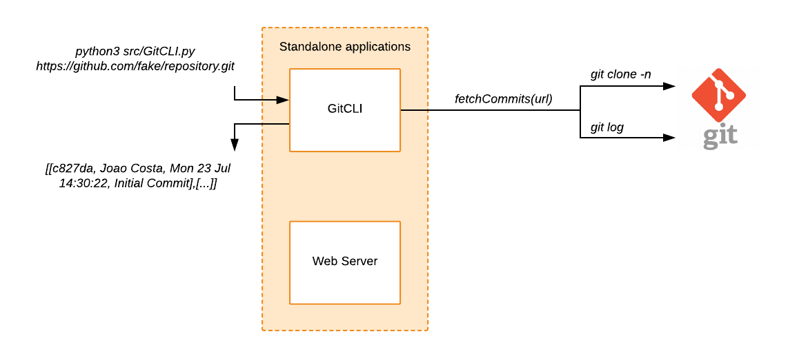
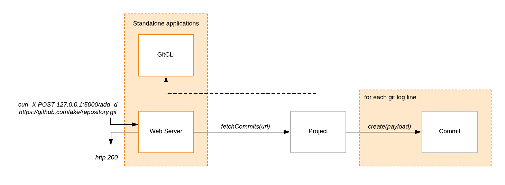
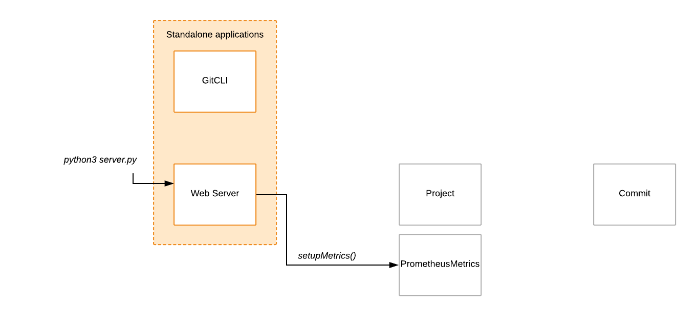
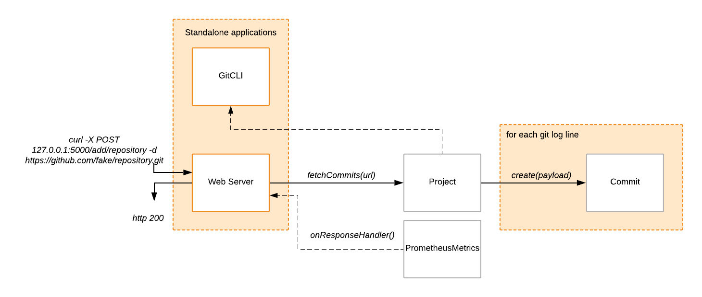
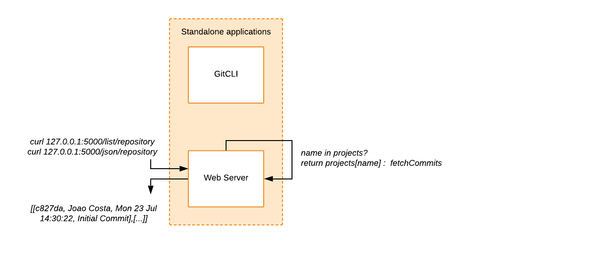
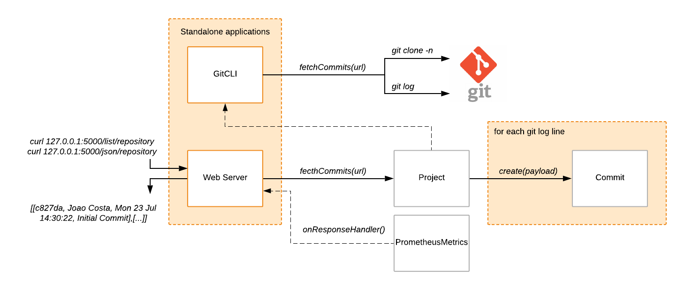
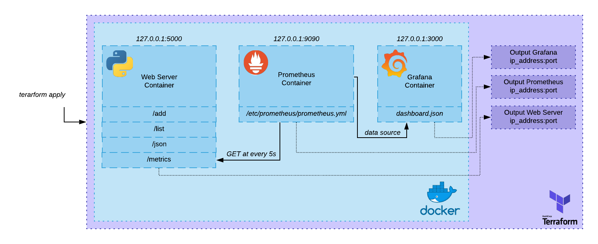
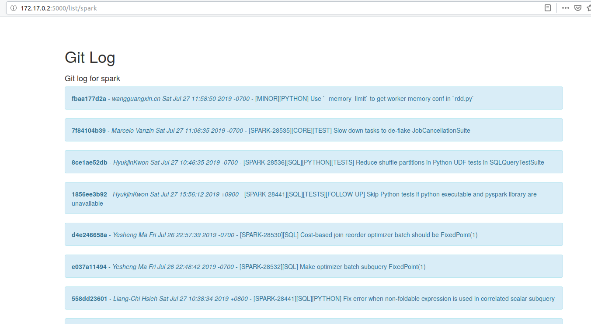
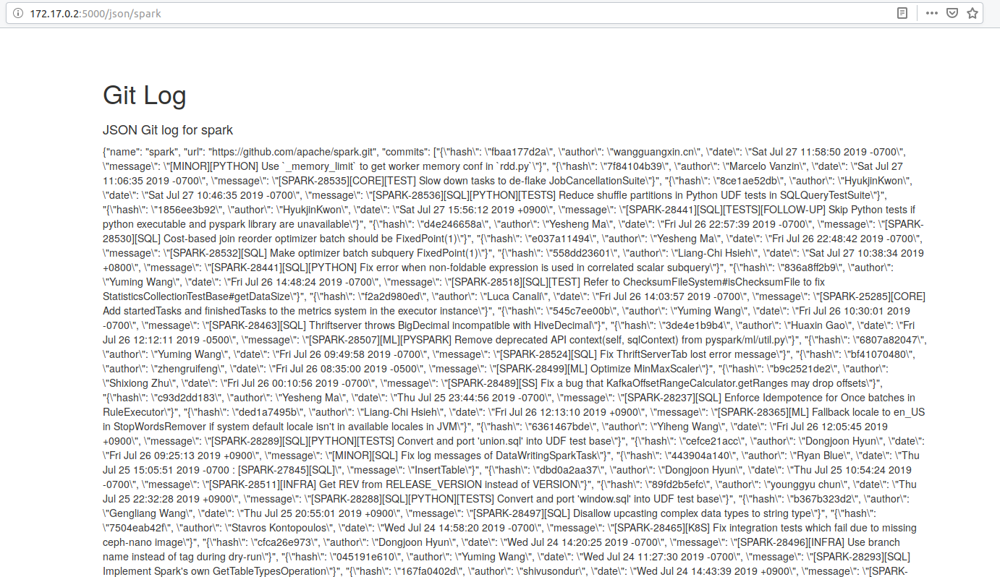
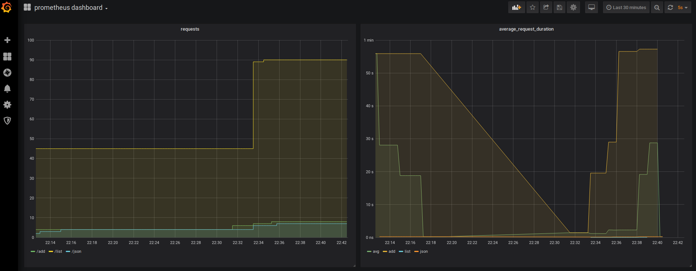

# git-monitoring-server
[](https://www.codacy.com/manual/joaopccosta/git-monitoring-server?utm_source=github.com&amp;utm_medium=referral&amp;utm_content=joaopccosta/git-monitoring-server&amp;utm_campaign=Badge_Grade)


## Architecture diagrams
There are three parts to this project's architecture: the Git Command Line Interface (CLI) application, the web server application, and the provisioning of both applications and infrastructure surrounding them.

I have chosen to use Python since it would allow me to quickly iterate on both applications, and it is easy to dockerise.

### Git CLI
The first part of the challenge consists of implementing a CLI wrapper for `git log` functionality.
That can be done with just one class, invoking two standard git CLI commands without resorting to any web API.

Given an HTTP/HTTPS git repository url, the tool returns a list containing relevant git log information such as the hash, author name, date, and message of the retrieved commits.
The implementation details are on the [next section](###GitCLI).

### Web Server
By leveraging this CLI wrapper, the server is then just another thin layer that models the retrieved data. Any commit will belong to a project with a given name and url. Therefore, we must be able to model this concept through Project and Commit classes respectively.

#### Adding a project
<details>

As such, when we ask for the commits of a given project, we must create a Commit per git log result, and store it within a Project class. Once we are done, we return success (or failure) from the server side with an HTTP code.

</details>

#### Instrumenting an add request
<details>

Since we are handling HTTP requests, we must instrument how many requests is our server receiving, and how long is it taking to dispatch them. `prometheus` is a time series based, metrics aggregating service that lets us record and plot that information. 
For this to happen, we need to attach some method callbacks so that when our HTTP requests are received, and our responses returned, we record the appropriate metrics.
This is done when the python server is first launched.



`prometheus` will later on contact our server at given intervals, on a specific route, to scrape the [recorded metrics](####Prometheus%20Metrics).

Now that we have metrics instrumentation attached to our HTTP requests and responses, when we ask the server to add a project (or do any other request), the handlers implemented in PrometheusMetrics will do just that.
The following image shows the end to end server process of adding a project, after it has been launched:


The implementation details are on the [next section](##Web%20Server).
</details>

#### Listing a project
<details>

The only thing left to do is to view a given project that has been added.
This can be done as html text or JSON. There are [two server endpoints](###Web%20Server) that do this respectively.

What the server does is look at it's internal Project dictionary. If a project with the same name exists, it returns the stored information. 

If the project is not found internally, the server returns an HTTP 404, while displaying an error page. 

This means that the information we are listing back to the user will be a cached version of the repository `git log`. If the user wants to update the git information, [the project needs to be added again](####%20Adding%20a%20project).
</details>

#### The full picture
This image displays all of the non-infrastructural parts (i.e. application code) involved in the project:


### Provisioning
Other than the application code, there is the infrastructure surrounding the web server that supports metric scraping and displaying.
All of the infrastructure is terraformed and dockerised. Additional files exist to support the infrastructure, such as a custom `prometheus.yml` and a `grafana-dashboard.json`, which are also provisioned through `terraform`.


## Requirements
I have used Ubuntu 19.04LTS while developing this project.
Therefore, any specific versions of tools used are tied to that particular operating system.
You must install:
* python 3.7.3

* pip 18.1

* terraform v0.12.5+

* docker 18.09.6+

* I had to follow [this Linux post install checklist](https://docs.docker.com/install/linux/linux-postinstall/) to ensure that `dockerd` was running. After doing so, my `DOCKER_HOST` was pointing to `127.0.0.1:2375` which is my default docker host address for `terraform`. If you are using anything other than Linux, please ensure that `dockerd` is running and configure `terraform` accordingly via `TF_VARS`.

First you must install all the required dependencies to be able to run this project locally.
```
pip3 install -r requirements.txt
```
This should install everything you need for [GitCLI.py]() and [server.py]() to work.

## Files and Modules
<details><summary>Application code files</summary>

* [GitCLI.py]() - Command line wrapper for git operations.

* [GitCLITest.py]() - Unit tests for GitCLI.py.

* [Commit.py]() - Data Transfer Object (DTO) which stores *hash, commiter name, date, and message* information.

* [Project.py]() - Mediator class between [Commit.py]() and [GitCLI.py](). Creates commit objects by fetching the information through the CLI, and stores them in a dictionary.

* [ProjectTest.py]() - Unit tests for Project.py.

* [server.py]() - Stateful object that receives requests, through different routes (see below). It holds a dictionary of Project objects, each object being created after being added to the server.

* [PrometheusMetrics.py]() - Helper class that records `prometheus` metrics per request received by the server.

* [requirements.txt]() - `pip3` list of dependencies for GitCLI.py and server.py.

</details>
<details><summary>Terraform files</summary>

  * [main.tf]() - `terraform` file that creates all the necessary containers, connects `prometheus` to `grafana` as a data source, and provisions the `grafana` dashboard.

  * [vars.tf]() - Defines port configurations and default docker host ip address.

  * [images.tf]() - Describes the docker images used by `terraform`.

  * [files.tf]() - Describes files that need to be provisioned into the containers.

  * * [prometheus.yml]() - Configuration override for the `prometheus` docker container.

  * * [prometheus-dashboard-template1.json]() - `grafana` dashboard json template.

</details>

<details><summary>Helper files</summary>

  * [deploy.sh]() - Convenience script to start the entire infrastructure.
  * [teardown.sh]() - Convenience script to destroy the entire infrastructure.
  * [testSuite.py]() - Scripted operations which will automatically populate some data into the `grafana` dashboards. More details in the [next section](###Test%20Suite).
</details>

<details><summary>File tree</summary>

```
.
├── deploy.sh
├── Dockerfile
├── infrastructure
│   ├── files.tf
│   ├── images.tf
│   ├── main.tf
│   ├── output.tf
│   ├── prometheus
│   │   ├── prometheus-dashboard-template1.json
│   │   └── prometheus.yml
│   └── vars.tf
├── README.md
├── requirements.txt
├── server.py
├── src
│   ├── Commit.py
│   ├── GitCLI.py
│   ├── helpers
│   │   ├── __init__.py
│   │   └── PrometheusMetrics.py
│   ├── __init__.py
│   └── Project.py
├── static
│   ├── css
│   │   └── bootstrap.min.css
│   ├── favicon.ico
│   ├── grafana.png
│   ├── json.png
│   └── list.png
├── teardown.sh
├── templates
│   ├── commits.html
│   ├── error.html
│   ├── index.html
│   └── json.html
├── test
│   ├── GitCLITest.py
│   └── ProjectTest.py
└── testSuite.py
```
</details>

## Implementation
### GitCLI
The command line tool allows you to get all the commit messages, in `pretty` format ([Git Docs](https://git-scm.com/book/en/v2/Git-Basics-Viewing-the-Commit-History)), given an HTTP/HTTPS git repository url.
You can use the GitCLI tool by running:
```
python3 src/GitCLI.py <http_git_repository_url>
```
Essentially, what the tool does, is a shallow checkout of just the meta-data (.git folder) of the repository.
It creates a shell subprocess, and does the checkout using `git clone -n <http_git_repository_url>`
Then, it changes to the checkout directory, running a `git log --pretty=format:"%h - %an, %ad : %s"` command.
After printing and returning the results, it cleans up after itself by deleting the checkout directory.

Naturally, the bigger the size of the repository meta-data (depending on the number of commits, tags, open branches, etc.), the longer the checkout time.

### Web Server
I have used Python's [Flask](https://palletsprojects.com/p/flask/) module to create this web server.

This web server is not tied up to any database for data persistence. This means that any stored information is ephemeral, and will be lost upon restarting the server docker container.

Please note that the web-server is tied to the local `DOCKER_HOST` ip address and port, all of the following examples use `127.0.0.1` as the target public ip address. However, this can change depending on how your docker installation is setup (for instance, I have had different results with MacOS).

#### POST route
```
/add/:projectname
curl -X POST http://127.0.0.1:5000/add/:projectname -d :http_git_repository_url
```
It is expected that the `http_git_repository_url` is provided in the data of the POST request.

#### GET routes
You can list all the commits from a given project by running:
```
/list/:projectname
curl http://127.0.0.1:5000/list/:projectname
```

You can list the entire project as JSON by running:
```
/json/:projectname
curl http://127.0.0.1:5000/json/:projectname
```
The `projectname` parameter has to match the name provided when running `/add/:projectname`.

#### User Interface

I have tried to create simple UI using [bootstrap](https://getbootstrap.com/), and Python's [Jinja2](http://jinja.pocoo.org/) for templating. From the UI, you should be able to see the results of a `/list/:projectname` and `/json/:projectname` in your browser. The templates used are located under the `templates` folder.

The following images display the results of both `/list` and `/json` requests from a browser for a project named [`spark`](https://github.com/apache/spark).
<details>
<summary>User Interface Screenshots</summary>





</details>


#### Prometheus metrics

The `/metrics` route is defined so that `prometheus` can scrape the two values:
* request_count - API Request Count - `Counter` type
* request_latency_seconds - API Request latency - `Histogram` type

For that, I have used the [prometheus_client](https://github.com/prometheus/client_python) python module.

I provide a `prometheus.yml` config file, which is passed onto the `prometheus` container by `terraform` (see below).

### Dockerfile

I simply created a docker image which runs python 3 and installs my `requirements.txt` through `pip3`. After that, I expose a port which is provided as a parameter to listen for the server requests.

<details><summary>Dockerfile</summary>

```
FROM python:3
WORKDIR /usr/src/app
COPY requirements.txt ./
RUN pip3 install --no-cache-dir -r requirements.txt
COPY . .
ARG port
RUN echo $port
EXPOSE $port
CMD ["python3", "./server.py"]
```
</details>


### Terraform
#### What is provisioned
Every piece is provisioned through `terraform` using `docker` containers and other types of resources:
* `web server` docker container instance running the image described above.
* `prometheus` docker container instance.
* `prometheus.yml` config file.
* `grafana` docker container instance.
* `grafana` data provider (`prometheus` instance).
* `grafana-dashboard-template1.json` dashboard template.

#### Container specific ports
All of these containers can be accessed by using your `DOCKER_HOST` ip address, followed by these ports:
1. The `web server` instance is expecting access through port `5000`.
2. The `prometheus` instance is expecting access through port `9090`.
3. The `grafana` instance is expecting access through port `3000`.

#### How to run
I provide two `bash` scripts for convenience in deploying (`deploy.sh`) and tearing down (`teardown.sh`) the infrastructure in an easier fashion. 

Under the hood, the `deploy.sh` script does the following, in order:
* build the `web server` image if it does not exist locally
* run `terraform init` on the `infrastructure` folder if it has not been initialised
* run `terraform apply --auto-approve` on the `infrastructure` folder twice.

The reason for running `terraform apply` twice is that `terraform` fails to connect to `grafana` via tcp on port `3000` to attach `prometheus` as a data provider, and to provision the dashboard template. I could not find a work around this issue and as such my solution was to run the command twice.

`terraform` will output the ip addresses and ports of all the instances described above once completed.

#### Provisioning specifics

There is a `prometheus.yml` file that I provision onto `/etc/prometheus/prometheus.yml` within the `prometheus` container, so that it can scrape the `web server` instance. This is because the ip address of the `web server` is only known during `terraform` provisioning, so it needs to be injected into this file.

As such, I do a text replacement on this file, replacing a `server-ip` token with the actual ip address of the `web server` instance.

#### Test Suite

I provide a `testSuite.py` file that performs a series of operations on the web-server, just for convenience, so that I could populate data onto `prometheus` and `grafana` without tending to the computer, mimmicking what could happen in real life. 

The script uses three different repository URLs, with different commit list sizes at the time of writing this document:
* joaopccosta/effective-bassoon - 2 commits
* chrislgarry/Apollo-11 - 308 commits
* apache/spark - 24,788 commits

It runs *n* `web server` requests, where *n* is the first argument on the command line, waiting for *[1s, 60s]* between operations at random. The operations are random in terms of web server route *(add|list|json)*, and in terms of the repositories mentioned above.


The following command will perform 300 random operations:
```
python3 testSuite.py 300

```
<details><summary>Sample output</summary>

```
/usr/bin/python3.7 /home/joaopccosta/repositories/git-monitoring/testSuite.py 300
 Performing 300 operations...
Running ['curl', '-s', 'http://127.0.0.1:5000/json/effective-bassoon']
Sleeping for 55s...
Running ['curl', '-s', 'http://127.0.0.1:5000/list/effective-bassoon']
Sleeping for 8s...
Running ['curl', '-s', 'http://127.0.0.1:5000/list/Apollo-11']
Sleeping for 31s...
Running ['curl', '-s', 'http://127.0.0.1:5000/list/spark']
Sleeping for 51s...
Running ['curl', '-s', '-X', 'POST', 'http://127.0.0.1:5000/add/effective-bassoon', '-d', 'https://github.com/joaopccosta/effective-bassoon.git']
Sleeping for 32s...
Running ['curl', '-s', 'http://127.0.0.1:5000/list/effective-bassoon']
Sleeping for 28s...
Running ['curl', '-s', '-X', 'POST', 'http://127.0.0.1:5000/add/spark', '-d', 'https://github.com/apache/spark.git']
...
```

</details>

### Grafana

`grafana` lets us visualise `prometheus` queries in a much cleaner and persistent may. I have provisioned the following dashboard through `terraform`.

I have kept the default credentials `admin:admin`, since all we are doing  is visualising non-sensitive data.

The following dashboard and panels are provisioned through `terraform` by passing `grafana-dashboard-template1.json` dashboard template mentioned above. 


I have composed the queries used thanks to the [Prometheus official documentation on Histograms](https://prometheus.io/docs/practices/histograms/). 

The panel on the top left shows the count for each request endpoint *(add|list|json)* regardless of the *http_status* code, whereas on the bottom left we can see the count of failed requests.
On the right we see the average request duration (latency) for each endpoint *(add|list|json)*.
<details><summary>request_count queries</summary>

```
sum(request_count_total{endpoint=~"/add/.+"})
sum(request_count_total{endpoint=~"/list/.+"})
sum(request_count_total{endpoint=~"/json/.+"})
```

</details>

<details><summary>failed request_count queries</summary>

```
sum(request_count_total{endpoint=~"/add/.+", http_status=~"400|404|500"})
sum(request_count_total{endpoint=~"/list/.+", http_status=~"400|404|500"})
sum(request_count_total{endpoint=~"/json/.+", http_status=~"400|404|500"})
```

</details>

<details><summary>request_latency queries</summary>

```
sum(rate(request_latency_seconds_sum{endpoint!~"/metrics|/static/.+"}[5m])) / 
  sum(rate(request_latency_seconds_count{endpoint!~"/metrics|/static/.+"}[5m]))

sum(rate(request_latency_seconds_sum{endpoint=~"/add/.+"}[5m])) / 
  sum(rate(request_latency_seconds_count{endpoint=~"/add/.+"}[5m]))

sum(rate(request_latency_seconds_sum{endpoint=~"/list/.+"}[5m])) / 
  sum(rate(request_latency_seconds_count{endpoint=~"/list/.+"}[5m]))

sum(rate(request_latency_seconds_sum{endpoint=~"/json/.+"}[5m])) / 
  sum(rate(request_latency_seconds_count{endpoint=~"/json/.+"}[5m]))
```
</details>


## Where to go next
The following points explain potential areas where I could continue working on this project.
#### Web UI
Web UI design and implementation is definitely not one of my areas of expertise,since I have never had the need to work with it. As such, creating a form to add projects through the browser UI should be the next step to improve the application, eliminating the need to `curl` the requests.

#### Dockerhub images
One of the things that I have not managed to provision through `terraform` was to use my [public docker images from dockerhub](https://cloud.docker.com/u/joaopccosta/repository/docker/joaopccosta/git-monitoring-server). This repository does have a git hook on dockerhub, so that any push to the release branch (master), triggers a build of the Dockerfile in dockerhub. I am a big fan of continuous integration and deployment and as such I should leverage this dockerhub capability for greater automation of the project.

#### Ephemeral data
If the web server container is restarted for some reason, the added projects are wiped from the system. Adding a containerised database should be the next step for this application to achieve data persistence.

#### Query caching
By adding a database, to reduce response time, an in-memory cache such as memcached or redis could be added to improve response times. One would also have to consider how often should the cache be invalidated, so that you reply to the user with the latest commit info and not with an off-sync version of the `git log`.

#### Horizontal scaling
From this point, the next step should be to allow multiple web-servers. To achieve this, one would use a load balancer, perhaps `HAProxy` or `nginx` are good dockerised candidates.
In addition, one could also provision for database read-replicas at this point, to take away some of the load from the master database.
All in all, this would be the approach I would take to ensure greater availability and fault tolerance.

---
Thank you for reading. 🤓️
