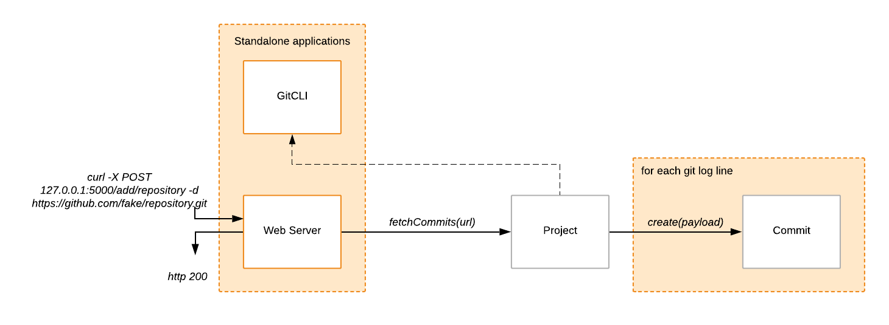
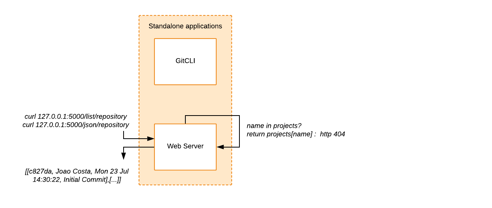
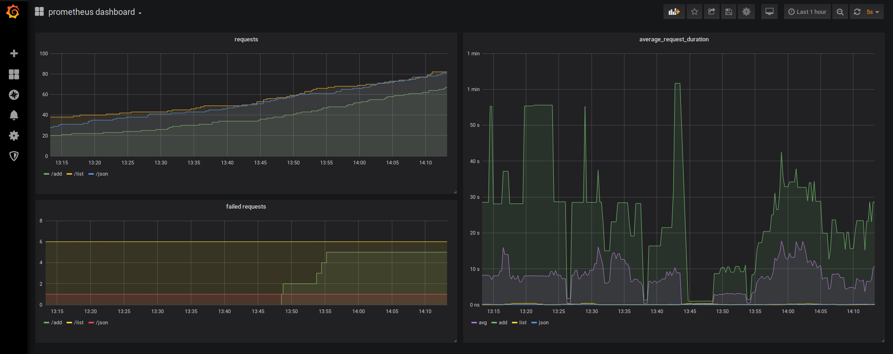

# git-monitoring-server

## Architecture diagrams

### Git CLI
The first part of the challenge consists of implementing a cli wrapper for `git log` functionality.
That can be done with just one class, invoking two standard git cli commands without resorting to any web API.

Given an HTTP/HTTPS git repository url, the tool returns a list containing relevant git log information such as the hash, author name, date, and message of the retrieved commits.
The implementation details are on the [next section](###GitCLI).

### Web Server
By leveraging this cli wrapper, the server is then just another thin layer that models the retrieved data. Any commit will belong to a project with a given name and url. Therefore, we must be able to model this concept through Project and Commit classes respectively.

As such, when we ask for the commits of a given project, we must create a Commit per git log result, and store it within a Project class. Once we are done, we return success (or failure) from the server side with an HTTP code.


Since we are handling HTTP requests, we must instrument how many requests is our server receiving, and how long is it taking to dispatch them. Prometheus is a time series based, metrics aggregating service that lets us record and plot that information. 
For this to happen, we need to attach some method callbacks so that when our HTTP requests are received, and our responses returned, we record the appropriate metrics.
This is done when the python server is first launched.

Prometheus will later on contact our server at given intervals, on a specific route, to scrape the [recorded metrics](####Prometheus%20Metrics).





The implementation details are on the [next section](##Web%20Server).

### Provisioning


## Requirements
I have used Ubuntu 19.04LTS while developing this project.
Therefore, any specific versions of tools used are tied to that particular operating system.
You must install:
* python 3.7.3
* pip 18.1
* terraform v0.12.5+
* docker 18.09.6+
* I had to follow [this post install checklist](https://docs.docker.com/install/linux/linux-postinstall/) to ensure that dockerd/docker service was running. After doing so, my `DOCKER_HOST` was pointing to `127.0.0.1:2375` which is the default docker host for terraform.

## Structure

```
.
├── deploy.sh
├── Dockerfile
├── infrastructure
│   ├── files.tf
│   ├── images.tf
│   ├── main.tf
│   ├── output.tf
│   ├── prometheus
│   │   ├── prometheus-dashboard-template1.json
│   │   └── prometheus.yml
│   └── vars.tf
├── README.md
├── requirements.txt
├── server.py
├── src
│   ├── Commit.py
│   ├── GitCLI.py
│   ├── helpers
│   │   ├── __init__.py
│   │   └── PrometheusMetrics.py
│   ├── __init__.py
│   └── Project.py
├── static
│   ├── css
│   │   └── bootstrap.min.css
│   ├── favicon.ico
│   ├── grafana.png
│   ├── json.png
│   └── list.png
├── teardown.sh
├── templates
│   ├── commits.html
│   ├── error.html
│   ├── index.html
│   └── json.html
├── test
│   ├── GitCLITest.py
│   └── ProjectTest.py
└── testSuite.sh
```

## Implementation
### GitCLI

First you must install all the required dependencies to be able to run this tool locally.
```
pip3 install -r requirements.txt
```

The command line tool allows you to get all the commit messages, in `pretty` format ([Git Docs](https://git-scm.com/book/en/v2/Git-Basics-Viewing-the-Commit-History)), given an http git repository url.
You can use the GitCLI tool by running:
```
python3 src/GitCLI.py <http_git_repository_url>
```
Essentially, what the tool does, is a shallow checkout of just the meta-data (.git folder) of the repository.
It creates a shell subprocess, and does the checkout using `git clone -n <http_git_repository_url>`
Then, changes to the checkout directory, running a `git log --pretty=format:"%h - %an, %ad : %s"` command.
After collecting all the results (and printing them out), it cleans up after itself by deleting the checkout directory.

Naturally, the bigger the size of the repository meta-data (depending on the number of commits, tags, open branches, etc.), the longer the checkout time.

I chose to use python since it would allow me to quickly iterate on both tests and source files. 

### Web Server

I have used Python's [Flask](https://palletsprojects.com/p/flask/) module to create this web server.

All of the dependencies are listed in the `requirements.txt` file.

This web server is not tied up to any database for data persistence. This means that any stored information is ephemeral, and will be lost upon restarting the server docker container.

Please note that the web-server is tied to the local `DOCKER_HOST` ip address and port, all of the following examples use `127.0.0.1` as the target public ip address. However, this can change depending on how your docker installation is setup (for instance, I have had different results with MacOS).

#### Files and Modules
* GitCLI.py - Command line wrapper for retrieving `git log info` (see above).
* Commit.py - Data Transfer Object (DTO) which stores *hash, commiter name, date, and message* information.
* Project.py - "Mediator" class between `Commit.py` and `GitCLI.py`. Creates commit objects by fetching the information through the cli, and stores them in a dictionary.
* server.py - Stateful object that receives requests, through different routes (see below). It holds a dictionary of Project objects, each object being created after being added to the server.
* PrometheusMetrics.py - Helper class that records Prometheus metrics per request received by the server.

#### POST route
```
/add/:projectname
curl -X POST http://127.0.0.1:5000/add/:projectname -d :http_git_repository_url
```
It is expected that the `http_git_repository_url` is provided in the data of the POST request.

#### GET routes
You can list all the commits from a given project by running:
```
/list/:projectname
curl http://127.0.0.1:5000/list/:projectname
```

You can list the entire project as JSON by running:
```
/list/:projectname
curl http://127.0.0.1:5000/json/:projectname
```
The `projectname` parameter has to match the name provided when running `/add/:projectname`.

#### User Interface

I have tried to create simple UI using [bootstrap](https://getbootstrap.com/), and Python's [Jinja2](http://jinja.pocoo.org/) for templating. From the UI, you should be able to see the results of a `/list/:projectname` and `/json/:projectname` in your browser.

The following images display the results of both `/list` and `/json` requests from a browser for a project names [`spark`](https://github.com/apache/spark).


The templates used are all located under the `templates` folder.

#### Prometheus metrics

The `/metrics` route is defined so that Prometheus can scrape the two values:
* request_count - API Request Count - `Counter` type
* request_latency_seconds - API Request latency - `Histogram` type

For that, I have used the [prometheus_client](https://github.com/prometheus/client_python) python module.

I provide a `prometheus.yml` config file, which is passed onto the Prometheus container by terraform (see below).

### Dockerfile

I simply created a docker image that which runs python 3 but installs my `requirements.txt` through `pip3`. After that, I expose a port which is provided as a parameter to listen for the server requests.
```
FROM python:3
WORKDIR /usr/src/app
COPY requirements.txt ./
RUN pip3 install --no-cache-dir -r requirements.txt
COPY . .
ARG port
RUN echo $port
EXPOSE $port
CMD ["python3", "./server.py"]
```
### Terraform
#### What is provisioned
Every piece is provision through terraform using docker containers and other types of resources:
* `web server` docker container instance running the image described above
* `prometheus` docker container instance
* `prometheus.yml` config file
* `grafana` docker container instance
* `grafana` data provider (prometheus instance)
* `grafana-dashboard-template1.json` dashboard template

#### Container specific ports
All of these containers can be access by using your `DOCKER_HOST` ip address, followed by these ports:
1. The web server instance is expecting access through port `5000`
2. The prometheus instance is expecting access through port `9090`
3. The grafana instance is expecting access through port `3000`

#### How to run
I provide two `bash` scripts for convenience in deploying (`deploy.sh`) and tearing down (`teardown.sh`) the infrastructure in an easier fashion. 

Under the hood, the `deploy.sh` script does the following, in order:
* build the web server image if it does not exist locally
* run `terraform init` on the `infrastructure` folder if it has not been initialised
* run `terraform apply --auto-approve` on the `infrastructure` folder twice.

The reason for running `terraform apply` twice is that terraform fails to connect to grafana via tcp on port 3000 to attach prometheus as a data provider, and to provision the dashboard template. I could not find a work around this issue and as such my solution was to run the command twice.

Terraform will output the ip addresses and ports of all the instances described above once completed.

#### Provisioning specifics

There is a `prometheus.yml` file that I provision onto `/etc/prometheus/prometheus.yml` within the Prometheus container, so that it can scrape the `web server` instance. This is because the ip address of the `web server` is only known during terraform provisioning, so it needs to be injected into this file.

As such, I do a text replacement on this file, replacing a `server-ip` token with the actual ip address of the `web server` instance.

#### Test Suite

I provide a `testSuite.sh` file that performs a series of operations on the web-server, just for convenience. It does not do anything clever.
It uses three different repository URLs, with different commit list sizes:
* joaopccosta/effective-bassoon - 2 commits
* chrislgarry/Apollo-11 - 308 commits
* apache/spark - 24,788 commits

### Grafana

Grafana lets us visualise Prometheus queries in a much cleaner and persistent may. I have provisioned it through terraform, although I kept the default credentials `admin:admin`, since all we are doing here is visualising non-sensitive data.

The following dashboard and panels are provisioned through terraform by passing `grafana-dashboard-template1.json` dashboard template mentioned above. 

The image does not do justice to visualising spikes in request latency.😇️

The image on the left shows the count for each request endpoint (add|list|json), where the queries are:
```
sum(request_count_total{endpoint=~"/add/.+"})
sum(request_count_total{endpoint=~"/list/.+"})
sum(request_count_total{endpoint=~"/json/.+"})
```

The image on the right shows the average request duration (latency) for each endpoint (add|list|json), where the queries are:
```
sum(rate(request_latency_seconds_sum{endpoint!~"/metrics|/static/.+"}[5m])) / 
  sum(rate(request_latency_seconds_count{endpoint!~"/metrics|/static/.+"}[5m]))

sum(rate(request_latency_seconds_sum{endpoint=~"/add/.+"}[5m])) / 
  sum(rate(request_latency_seconds_count{endpoint=~"/add/.+"}[5m]))

sum(rate(request_latency_seconds_sum{endpoint=~"/list/.+"}[5m])) / 
  sum(rate(request_latency_seconds_count{endpoint=~"/list/.+"}[5m]))

sum(rate(request_latency_seconds_sum{endpoint=~"/json/.+"}[5m])) / 
  sum(rate(request_latency_seconds_count{endpoint=~"/json/.+"}[5m]))
```
I have composed these queries thanks to the [Prometheus official documentation on Histograms](https://prometheus.io/docs/practices/histograms/). 

## Where to go next
The following points explain potential areas where I could continue working on this project.
#### Web UI
Web UI design and implementation is definitely not one of my areas of expertise, as I have never had the need to work with it. As such, creating a form to add projects through the browser UI should be the next step to improve the application.

#### Dockerhub images
One of the things that I haven't managed to provision through `terraform` was to use my public docker images from dockerhub. This repository does have a git hook on dockerhub, so that any push to the release branch (master), triggers a build for the Dockerfile on dockerhub. I am a big fan of continuous integration and deployment, and as such I should leverage this dockerhub capability for greater automation of the project.

#### Ephemeral data
If the web-server container is restarted for some reason, the added projects are wiped from the system. Adding a containerised database should be the next step for this application to achieve data persistence.

#### Query caching
By adding a database, to reduce response time, an in-memory cache such as memcached or redis could be added to improve response times. One would also have to consider how often should the cache be invalidated, so that you reply to the user with the latest commit info and not with an off-sync version of the `git log`.

#### Horizontal scaling
From this point, the next step should be to allow multiple web-servers. To achieve this, one would use a load balancer, perhaps HAProxy of NGINX are good examples.
In addition, one could also provision for database read-replicas at this point, to take away some of the load from the master database.
